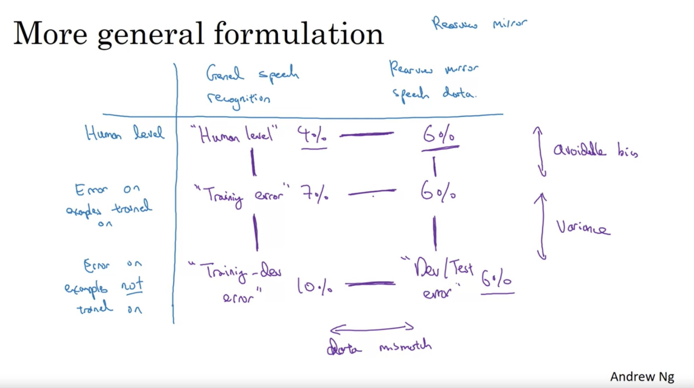
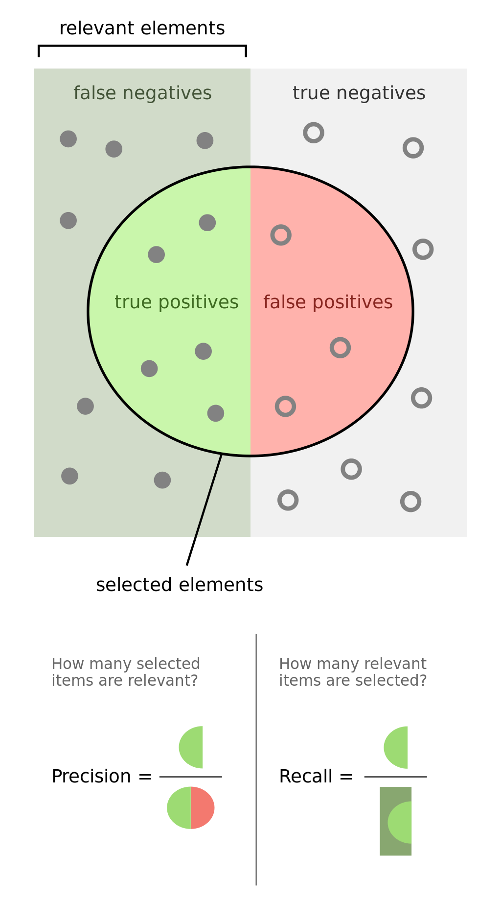
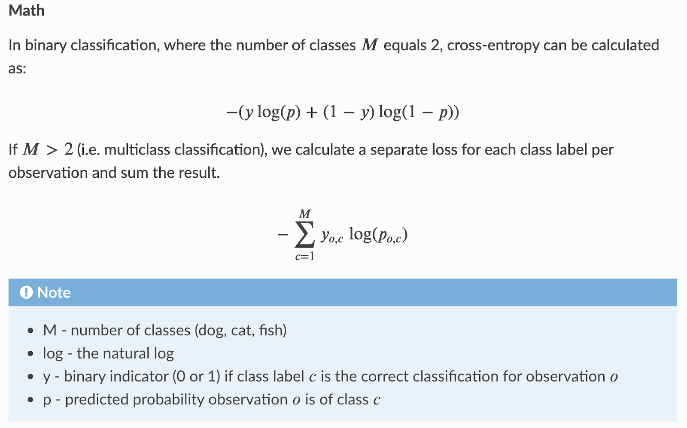
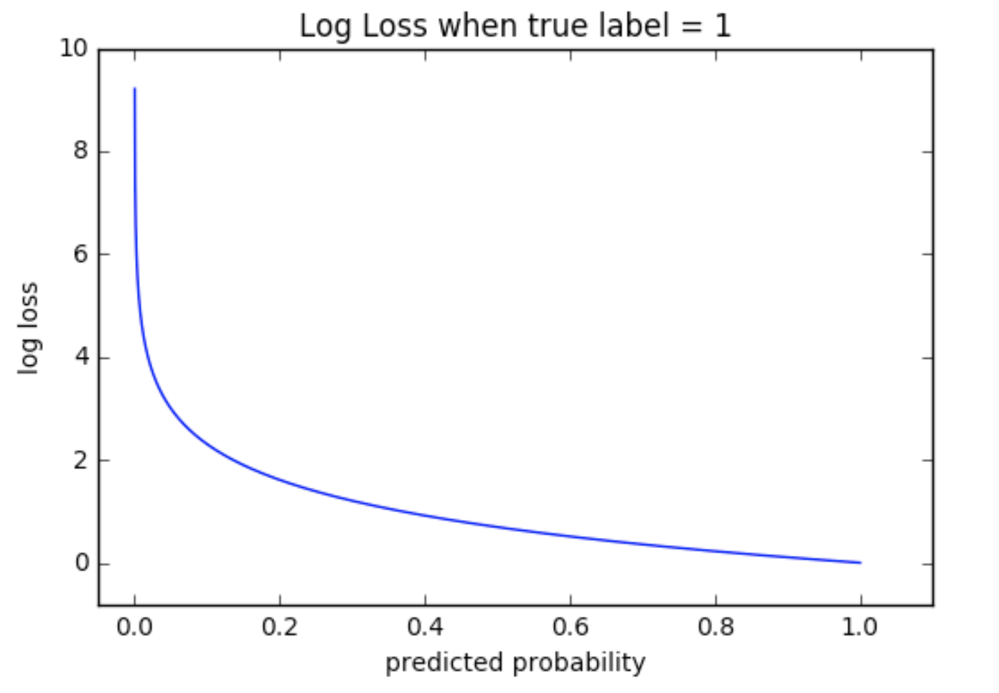

# Data Science Cheet Sheet

Data science is a concept to unify statistics, data analysis, machine learning, domain knowledge 
and their related methods in order to understand and analyze actual phenomena with data.

## Table of Contents

- [Statistics](#statistics)
- [Machine Learning](#machine-learning)
    - [Neural Networks](#neural-networks)
    - [Structuring ML Projects](#structuring-ml-projects)
    - [Convolutional Neural Networks](#convolutional-neural-networks)
    - [Sequence Models](#sequence-models)
    - [Heroes of ML](#heroes-of-ml)
- [AI for Industries](#ai-for-industries)
    - [AI for Healthcare](#ai-for-healthcare)
    - [AI for Financial Services](ai-for-financial-services)
- [Data Science Tools](#data-science-tools)
    - [Google Colab](#google-colab)
- [Resources](#resources)

## Statistics

TODO 

https://www.youtube.com/watch?v=xxpc-HPKN28

Individuals vs characteristics

Population (census) vs sample

Parameters vs samples

Descriptive vs inferential

Normal distribution and empirical rule (68-95-99.7)

z-score

Inference: Estimation, Testing, Regression

Central limit theorem:
- The sampling distribution (the distribution of x-bars (mean of the sample) from all possible samples) is also a normal distribution.
- The mean of x-bars is equal to mean of the population.
- The standard deviation of the x-bars is standard deviation of population divided by sqrt(n).

https://www.khanacademy.org/math/statistics-probability/significance-tests-one-sample/more-significance-testing-videos/v/hypothesis-testing-and-p-values

p-value - the probability of getting a certain result given the null-hypothesis. 

## Machine Learning

### Neural Networks

- [Deep Learning Specialization, GitHub](https://github.com/medvedev1088/deep-learning-coursera)
- [Building your Deep Neural Network - Step by Step, Google Colab](https://colab.research.google.com/drive/1_HQrowDxJRc38Gej3wPCttYBJmMiznrl)
- [Deep Neural Network - Application, Google Colab](https://colab.research.google.com/drive/1cXdV6xQboB5zk1MEQRK-zV3UHw7f3wjr)

DNN implementations:

- Python: TODO
- Python + numpy: 
    - [Implementation of a Deep Neural Network in Python](./deep_neural_net_python)
    - Simple NN with numpy: https://pytorch.org/tutorials/beginner/pytorch_with_examples.html#warm-up-numpy
- TensorFlow: TODO
- Keras: TODO

### Structuring ML Projects

It is better to find a single optimization metric, this way it will be easier to choose a better model.
When it's not possible to choose a single optimization metric, you can add **satisfying** metrics. 
For example, error rate is an optimization metric and the time it takes to run the classification on an object is a 
satisfying metric.
 
**Bayes error rate** is the lowest possible error rate for any classifier of a random outcome 
(into, for example, one of two categories) and is analogous to the irreducible error.

If your algorithm is performing worse than a human, then to improve your algorithm you can:
- Get labeled data from humans.
- Gain insight from manual error analysis: why did a person get this right?
- Better analysis of bias/variance.

**When to focus on bias and when on variance**:
- If human error is **1%**, train error is **8%**, dev error is **10%**, then focus on **avoidable bias**, i.e reducing the train error,
    because it can potentially be reduced by 7 pp, compared to just 2 pp for dev error. To reduce the train error you can try the following:
    - Train a bigger model
    - Train longer
    - Try better optimization algorithms: RMSProp, Adam
    - Try a different NN architecture: RNN, CNN
    - Hyperparameter search 
- If human error is **7%**, train error is **8%**, dev error is **10%**, then focus on **variance**, i.e reducing the dev error,
    because it can potentially be reduced by 2 pp, compared to just 1 pp for train error. To reduce the dev error you can try the following:
    - Add more data
    - Regularization: L1, L2, dropout, 
    - Data augmentation
    - Try a different NN architecture: RNN, CNN
    - Hyperparameter search 

Problems where ML significantly surpasses human-level performance:
- Online advertising
- Product recommendations
- Logistics (predicting transit time)
- Loan approvals

All of the above are **ML on structured data** as opposed to natural perception.

Advice from Andrej Karpathy for learning ML: try implementing a NN from scratch, without relying on any libraries
like TensorFlow. This will help you learn how deep learning works under the hood.

**Error Analysis**: focus on what contributes most to the algorithm error. For example, if 90% of errors are due to
blurry images and 10% are due to misclassified as a dog instead of a cat, then focus on blurry images to reduce the error.  

**Incorrectly labeled data**: 
- fix it if it contributes a significant portion to error; 
- fix it across train, dev, test datasets universally. Otherwise it may introduce bias to the dataset.

It's important to make your dev and test datasets as close to real-world data, even if it results in 
train and dev/test datasets be drawn from different distributions. This way you optimise to the right target. 
In this case to perform bias/variance analysis introduce train-dev dataset, to measure the variance contribution 
to error.

**Transfer Learning** - using intermediate NN layers, that were pre-trained on some problem A, for a different problem B.
For example problem A can be classifying cats and dogs, problem B can be classifying lung desease in radiology images.
It makes sense when:
- Problems A and B have the same input.
- There is a lot more input for problem A than for problem B.
- Low level features from A could be helpful for learning B.    

**Multi-task Learning** - training a NN for a classification problem where an input can be assigned multiple classes,
for example an image which can contain cars, pedestrians, stop signs, traffic lights, or any combination of those.
It can give better results than training a separate NN for each class, because the intermediate layers are reused.

**End-to-end ML** - solving a problem using just an ML algorithm without any hand-designed components as part of the 
whole system. For example, for a **speech recognition** task an end-to-end ML approach is to use audio as an input for
an ML algorithm and the transcript as the output, as opposed to manually extracting features from the audio first,
then phonemes, the words, and then generating a transcript.
- Pros: let the data speak, less hand-designing of components needed.
- Cons: may need large amount of data, excludes potentially useful hand-designed components.

### Convolutional Neural Networks

Colab Notebooks:

- [Rock-paper-scissors classfication](https://colab.research.google.com/drive/1M_0bhHeBJznr4XC5QI_mLPJ4Iut_HjH6)
- [Fashion MNIST image classification (with intermediate layers visualization)](https://colab.research.google.com/drive/1ZPipu8FLPMf4sZ3E-v3rocmXC-58sRV_)
- [Cats vs dogs (with intermediate layers visualization)](https://colab.research.google.com/drive/1-JKPuRrBDpCUjE8oixEoilLdRWWEQt89)

Why convolutions:

- Parameter sharing
- Sparsity of connections

Computer Vision Networks:

- AlexNet
- VGG-16 - 16 layers of "same" ConvLayers and MaxPooling layers
- ResNet
- Inception Network

Face Recognition:

- One Shot Learning, Triplet Loss

Neural Style Transfer:

- https://colab.research.google.com/github/tensorflow/models/blob/master/research/nst_blogpost/4_Neural_Style_Transfer_with_Eager_Execution.ipynb

DeepFake Colab:
 
- https://colab.research.google.com/github/AliaksandrSiarohin/first-order-model/blob/master/demo.ipynb

YOLO (You Only Look Once) algorithm:
- https://colab.research.google.com/drive/1z17LS1eCsw8I2EAMkaCI3PrTHJc201cu

### Sequence Models

TODO: Add more details

- RNN (Recurrent Neural Network) - has a problem of exploding/vanishing gradients.
- LSTM (Long Short-Term Memory Network) - solves the problem of exploding/vanishing gradients by
    adding memory units.
- GRU (Gate Recurrent Unit) - simplified version of LSTM.
- Attention Model - adds attention mechanism to LSTM: [Colab Notebook](https://colab.research.google.com/drive/1GLr_RE0yKgFePn3KYLPPpirtu5I1Q1x4) 

### Heroes of ML

- [Andrew Ng](https://twitter.com/AndrewYNg) - Co-Founder of Coursera; Stanford CS adjunct faculty. Former head of Baidu AI Group/Google Brain.
- [Andrej Karpathy](https://twitter.com/karpathy) - Director of AI at Tesla.
- [Geoffrey Hinton](https://twitter.com/geoffreyhinton) - Works for Google Brain, Professor at the University of Toronto.
- [Pieter Abbeel](https://twitter.com/pabbeel) - Director of the Berkeley Robot Learning Lab.
- [Ian Goodfellow](https://twitter.com/goodfellow_ian) - Director of machine learning in the Special Projects Group at Apple.
- [Ruslan Salakhutdinov](https://twitter.com/rsalakhu) - UPMC Professor of Computer Science at Carnegie Mellon University.
- [Yuanqing Lin](https://twitter.com/yuanqinglin) - CEO & Founder of Aibee, Former Head of Baidu Research.
- [Yann LeCun](https://twitter.com/ylecun) - Professor at NYU. Chief AI Scientist at Facebook.
- [Lex Fridman](https://twitter.com/lexfridman) - Research in machine learning, autonomous vehicles and human-centered AI. 
- [Jeremy Howard](https://twitter.com/jeremyphoward) - Distinguished research scientist: @usfca; 
    Co-founder: http://fast.ai; Chair: http://WAMRI.ai. 

## AI for Industries

### AI for Healthcare

[AI for Medicine Specialization, Coursera](https://www.coursera.org/specializations/ai-for-medicine)

**AI for Diagnosis:**

- Applications of AI for diagnosis (mostly computer vision):
    - Diagnosing edema in lungs from X-Rays scans.
    - Dermatology: detecting whether a mole is a skin cancer: https://www.nature.com/articles/nature21056.
    - Ophthalmology: diagnosing eye disorders using retinal fundus photos (e.g. diagnosing diabetic retinopathy).
    - Histopathology: determining the extent to which a cancer has spread from microscopic images of tissues.
    - Identifying tumors in MRI data - image segmentation. A CNN called U-Net is used for this.
- Challenges:
    - Patient Overlap - as an example, the model can memorize a necklace on X-Rays images of a single patient and 
        give an over-optimistic test evaluation. To fix this split train and test sets by patient, so that all images of 
        the same patient are either in train or test sets.
    - Set Sampling - when there is an imbalance dataset. Minority class sampling is used 
    - Ground Truth / Reference Standard - consensus voting.

**AI for Prognosis:**

- Applications of AI for prognosis (mostly applications of [Survival analysis](https://arxiv.org/pdf/1801.05512.pdf)):
    - Predicting risk of an event or when an event is likely to happen. E.g. death, heart attack or stroke, for people with a specific condition or for the general population. It's used to inform the patient and to guide the treatment.
        - Risk of breast or ovarian cancer using data from blood tests.
        - Risk of death for a person with a particular cancer.
        - Risk of a heart attack.
        - Risk of lung cancer recurrence after therapy.
- [Survival analysis](https://arxiv.org/pdf/1801.05512.pdf) is a field in statistics that is used to predict when 
    an event of interest will happen. The field emerged from medical research as a way to model 
    a patient's survival — hence the term "survival analysis". 
    - Censored data (end-of-study censoring, not-follow-up censoring) - we don't know the exact time of an event 
        but we know that the event didn't happen before time X.
    - Missing data: completely at random, at random, not at random. E.g. blood pressure measurements are missing for younger patients. 
    - Hazard, Survival to Hazard, Cumulative Hazard - functions that describe the probability of an event over time.
    - [C-index](https://square.github.io/pysurvival/metrics/c_index.html) - a measure of performance for a survival 
        model (concordance - patience with worse outcome should have higher risk score). 
    - Mortality score - the sum of hazards for different times.
    - Python library for Survival analysis https://github.com/square/pysurvival/.
	
**AI for Treatment:**

- Applications of AI for treatment (mostly statistical methods):
    - Treatment effect estimation - determining whether certain treatment will be effective for a particular patient. 
        The input is features of the patient, e.g. age, blood pressure and the output is the number representing risk 
        reduction or increase for an event e.g. stroke or heart attack. The data from randomized control trials is used 
        to train the model.
- Treatment effect estimation:
    - NNT (number needed to treat) = 1/ ARR (absolute risk reduction) - number of people who need to receive the 
    treatment in order to benefit one of them.
    - Factual - what happens to the patient with/without treatment - we know it. 
        Counterfactual - what would happen to the patient without/with treatment - we don't know it.
    - Average Treatment Effect - difference between means of outcomes with treatment and without treatment.
    - Conditional Average Treatment Effect - Average Treatment Effect given some conditions on the patient, e.g. age, 
        blood pressure.
    - Two Tree Method (T-Learner) - build two decision trees to estimate risk with and without treatment, then 
        subtract the values given by these trees.
    - C-for-benefit - similar to C-index but for treatment effect estimator evaluation.
- The task of extracting labels from doctors' unstructured reports on images of lung X-Rays. 
    1. occurrences of specific labels are searched for in the text. E.g. if the word "edema" is found in the report, 
        go to the next step. Because "edema" has synonyms, a special medical thesaurus called 
        [SNOMED CT](https://en.wikipedia.org/wiki/SNOMED_CT) is used to find synonyms and related terms.
    2. A Negation Classification is used to determine absence of a disease, e.g. if the report contains "no edema" 
        or "no evidence of edema". This requires labeled data. If there is no labeled data, then a simple Regex or 
        Dependency Parse rules are used.
        
Applications of Deep Learning in Medicine:

- [The wonderful and terrifying implications of computers that can learn | Jeremy Howard](https://youtu.be/t4kyRyKyOpo?t=627)

### AI for Financial Services

TODO

## Random Notes

- Train, dev, and test datasets:
    - Dev dataset prevents overfitting NN parameters (weights and biases) to the train data
    - Test dataset prevents overfitting NN hyper-parameters (model architecture, number of layers types of layers) 
        to the train and dev data.
    
- What stage are we at? Stages of an ML project:
    1. Individual contributor
    2. Delegation
    3. Digitization
    4. Big Data and Analytics
    5. Machine Learning 

- CRISP-DM model
    1. Business understanding
    2. Data understanding
    3. Data preparation
    4. Modeling
    5. Evaluation
    6. Deployment  
    
- Precision, recall, accuracy, sensitivity, specificity
    - Precision and recall https://en.wikipedia.org/wiki/Precision_and_recall
    - Accuracy = Sensitivity * prevalence + Specificity * (1 - prevalence)
    - F1-score = 2 / ((1/P) + (1/R)) - harmonic mean, average speed.
    

**Log loss (cross entropy loss)**:

 

- Most of the economic value is created by supervised learning.   
- tanh activation works better than sigmoid activation because it makes input data centered.
    Sigmoid should only be used in the last layer for classification because it's between 0 and 1 (probability).
- ReLU works better than sigmoid or tanh because, unlike sigmoid and tanh it's derivative is not approaching 0
    for very large or small values of input.
- Weights of the layers of a neural net should be initialized with random small numbers. If they are initialized
    with zeroes then all neurons of a layer will train to the same weights. If they are initialized as big numbers
    and sigmoid or tanh activation is used, they will become saturated quickly and the learning will stall. 
- Why deep neural nets work better than shallow for complex functions: to calculate XOR of N parameters a deep
    neural net needs `log(N)` units, while a shallow neural net needs `2^n` units. A shallow net would be much bigger.      

**GPT**:
- GPT-3 vs Human Brain, Lex Fridman: https://www.youtube.com/watch?v=kpiY_LemaTc
- Write with Transformer (Get a modern neural network to auto-complete your thoughts): https://transformer.huggingface.co/ 

## Data Science Tools

### Google Colab

- [10 Minutes to Pandas](https://colab.research.google.com/drive/1LuUxoGo1yELpJ9JKnQF2Mujdm_9RYVqR)
- [Keras Hello World](https://colab.research.google.com/drive/14D_1LHcgFdTjmHzDtJV3M6h4flSR-pyK)
- [Fashion MNIST image classification with intermediate layers visualization](https://colab.research.google.com/drive/1ZPipu8FLPMf4sZ3E-v3rocmXC-58sRV_)
- Natality dataset in BigQuery:
    - [Exploring natality dataset](https://colab.research.google.com/drive/1LRNXqmjURFwMyjyrHgptsZ8vozYafefU)
    - [Creating a sampled dataset](https://colab.research.google.com/drive/1VQBd37-EVw9z5To4o8GE6oX8iHqcL7c-)
    - [DNN to predict baby weight with TensorFlow](https://colab.research.google.com/drive/1xbEL-0gaEmq-CyTfGuC_CAs5vpCmrWdi)
    - [DNN to predict baby weight with Keras](https://colab.research.google.com/drive/1ebQ7nTqx_f6VpkBPi0MMB8QFrQHy2U9M)

## Resources

- [Deep Learning Specialization, Coursera](https://www.coursera.org/specializations/deep-learning) 
- [Deep Learning Specialization, Python Notebooks on GitHub](https://github.com/medvedev1088/deep-learning-coursera)
- [Deep Learning Specialization v2, Python Notebooks on GitHub](https://github.com/enggen/Deep-Learning-Coursera)
- [Machine Learning with TensorFlow on GCP Specialization, Coursera](https://www.coursera.org/specializations/machine-learning-tensorflow-gcp)
- [Advanced Machine Learning with TensorFlow on GCP Specialization, Coursera](https://www.coursera.org/specializations/advanced-machine-learning-tensorflow-gcp)
- [TensorFlow and Keras in Practice Specialization, Coursera](https://www.coursera.org/specializations/tensorflow-in-practice)
- [Neural Networks and Deep Learning, book by Michael Nielsen](http://neuralnetworksanddeeplearning.com/)  
- [PyTorch at Tesla - Andrej Karpathy, YouTube](https://www.youtube.com/watch?v=oBklltKXtDE)
- [Tesla Autonomy Day, YouTube](https://www.youtube.com/watch?v=Ucp0TTmvqOE)
- [AI for Medicine Specialization, Coursera](https://www.coursera.org/specializations/ai-for-medicine)
- [Deep Learning State of the Art (2020) | MIT Deep Learning Series](https://www.youtube.com/watch?v=0VH1Lim8gL8)

